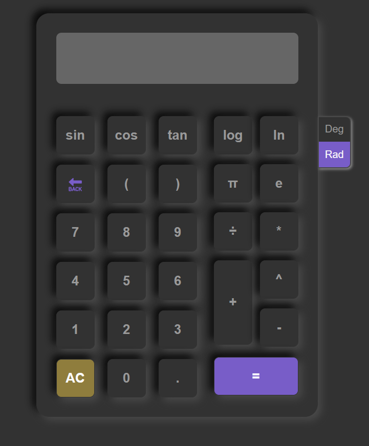

# Scientific-Calculator

## Scientific Calculator made using the Shunting-Yard Algorithm

### How does Shunting Yard Algorithm work:

- #### Convert the provided strings into tokens

```
29*33+45 => ['29', '*', '33', '+', '45']
```

- #### Convert the tokens into a infix/prefix notation

  - If the token is number, push it to an output list
  - Else, push it to an operator list
  - While pushing the operator:
    - if the operator's priority is greater than the last operator in the operator list, pop the operator list and push it to the output list, and repeat the previous step
  - Once the tokens are completed, push the remaining operator list to the output list

- #### Covert the prefix into postfix
  - If the data is number, push it to stack
  - Else, pop the two numbers from the stack, and perform the operation, and the push the result to stack
  - Repeat until the data list is empty
    Return the first index of stack, which is the answer

```
Note: For unary operators such as, sin, cos, log, ln etc. the data can only be popped once from the stack and perform the operation
```

### Responsive and Dark mode available


